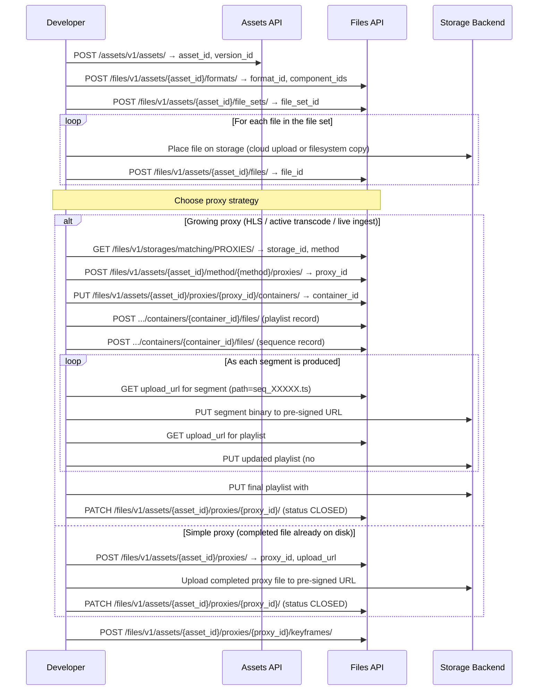

# Growing File Support in Iconik

## Overview

This guide covers the **complete end-to-end workflow** for registering assets in iconik and attaching proxies — with a focus on **growing file support**, the approach required when your proxy is an HLS stream being generated in real time.

Use this guide when:
- Your transcoder is producing HLS segments during an active encode and you need iconik to serve the proxy before the job finishes
- You are ingesting a live or linear stream and need a growing proxy representation in iconik while the stream is still ongoing

This guide also covers the full asset creation flow (format, file set, file registration) and a comparison of the simple completed-file proxy path vs. the growing proxy path, so it can be used as a standalone reference.

For a more narrative walkthrough of the iconik data model and completed-file proxy upload, see the [Manual Asset Generation README](../Manual%20Asset%20Generation/README.md).

---

## Iconik Data Model

An asset in iconik is not a single file — it is a pointer to a collection of related files that may live on many different storages simultaneously.

```
Asset
 ├── Format (ORIGINAL)
 │    └── File Set (e.g. GCS bucket)
 │         ├── File (Video MXF)
 │         ├── File (Audio MXF)
 │         └── File (Audio MXF)
 ├── Format (PPRO_PROXY)
 │    └── File Set (e.g. Amazon S3 bucket)
 │         └── File (ProRes MOV)
 └── Proxy (HLS or MP4 web proxy)
      └── Proxy Container
           ├── Proxy File (HLS master playlist)
           └── Proxy File (TS segment sequence)
```

| Object | Purpose |
|---|---|
| **Asset** | Top-level entity. Contains metadata, relationships, collection membership, and pointers to all file representations. |
| **Format** | Describes the technical metadata of a file representation (codec, frame rate, resolution, component streams). A single asset can have many formats. |
| **File Set** | Groups the physical files that make up a format on a specific storage. Contains component references and the storage location. |
| **File** | The actual file record: path, name, size, checksum, and storage reference. |
| **Proxy** | A lower-resolution representation of the asset used for web playback. The growing file path always uses HLS (`.m3u8` / `.ts`). |
| **Proxy Container** | Holds structural metadata for the HLS stream (segment duration, frame count, frame rate). Required for growing proxies. |

---

## Prerequisites

- An iconik API token (`Auth-Token` header)
- An iconik App ID (`App-ID` header)
- At least one configured storage in your iconik instance with a known `storage_id`
- The proxy storage details (fetched via API in [Step 5](#step-5-choose-your-proxy-strategy))

All iconik API calls use headers:
```
Auth-Token: <your-token>
App-ID: <your-app-id>
Content-Type: application/json
```

---

## Complete Workflow



---

## Step 1: Create the Asset

**Endpoint:** `POST /assets/v1/assets/`

**Request body:**
```json
{
  "is_online": true,
  "status": "ACTIVE",
  "title": "My New Asset",
  "type": "ASSET"
}
```

**Response:** Returns the full asset object. Note the `id` as your `asset_id`. For the `version_id`, use `default_version_id` — the asset's current version — falling back to the `id` inside the `versions` array on older records. Both are needed in subsequent calls, and you can re-read them at any time with `GET /assets/v1/assets/{asset_id}/`.

```json
{
  "id": "2c5bfe1a-f149-11eb-a843-0a580a3db916",
  "title": "My New Asset",
  "status": "ACTIVE",
  "versions": [
    {
      "id": "2c5c5ae0-f149-11eb-a843-0a580a3db916"
    }
  ]
}
```

---

## Step 2: Create a Format

Formats carry the technical metadata for the file representation you are registering. The `components` array describes each stream (video, audio, timecode, etc.) and its associated technical metadata.

**Endpoint:** `POST /files/v1/assets/{asset_id}/formats/`

**Request body:**
```json
{
  "asset_id": "<asset_id>",
  "components": [
    {
      "metadata": {
        "format": "DV",
        "format_commercial_ifany": "DVCPRO HD",
        "framerate": "59.940",
        "framecount": "1100",
        "height": "720",
        "width": "960",
        "bitrate": "97766400",
        "duration": "18.352",
        "scantype": "Progressive",
        "colorspace": "YUV",
        "chromasubsampling": "4:2:2",
        "bitdepth": "10"
      },
      "name": "VIDEO",
      "type": "VIDEO"
    },
    {
      "metadata": {
        "format": "PCM",
        "channels": "1",
        "samplingrate": "48000",
        "bitdepth": "16",
        "duration": "18.352",
        "bitrate": "768000"
      },
      "name": "AUDIO",
      "type": "AUDIO"
    }
  ],
  "metadata": [
    {
      "codec": "DVCPro HD",
      "format": "DV",
      "frame_count": "1100",
      "frame_rate": "59.94",
      "internet_media_type": "video/Quicktime",
      "overall_bit_rate": "97766400"
    }
  ],
  "name": "ORIGINAL",
  "status": "ACTIVE",
  "storage_methods": ["FILE"],
  "version_id": "<version_id>"
}
```

The `storage_methods` value reflects how files in this format are stored. Use `FILE` for ISG/filesystem storage, and `S3`, `GCS`, `AZURE`, or `B2` for cloud storage.

**Response:** Returns the format object. Note `id` as your `format_id` and each object's `id` inside `components` as your `component_ids`.

---

## Step 3: Create a File Set

A file set groups the physical files that make up a format on a specific storage. The `component_ids` array must reference the IDs returned by the components in Step 2. The `base_dir` is the root directory path of the file group, relative to your storage root.

**Endpoint:** `POST /files/v1/assets/{asset_id}/file_sets/`

**Request body:**
```json
{
  "asset_id": "<asset_id>",
  "base_dir": "Test_Content/MXF/AVCI_Card",
  "component_ids": [
    "<video_component_id>",
    "<audio_component_id_0>",
    "<audio_component_id_1>",
    "<audio_component_id_2>",
    "<audio_component_id_3>"
  ],
  "format_id": "<format_id>",
  "name": "0002EM.MXF",
  "status": "ACTIVE",
  "storage_id": "<storage_id>",
  "version_id": "<version_id>"
}
```

**Response:** Returns the file set object. Note `id` as your `file_set_id`.

---

## Step 4: Register Files

Register each physical file that belongs to this file set. The file must already exist on the target storage before you call this endpoint — iconik records the reference, it does not perform the upload. See [Storage-Specific File Placement](#storage-specific-file-placement) below for how to get files onto each storage type before registering them.

Repeat this call for each file in the file set.

**Endpoint:** `POST /files/v1/assets/{asset_id}/files/`

**Request body:**
```json
{
  "asset_id": "<asset_id>",
  "checksum": "38f7f32d194b725bd0b1855a6e35d3d3",
  "directory_path": "Test Content/MXF/AVCI_Card/CONTENTS/VIDEO/",
  "date_created": "2007-05-16T19:21:20.000000+00:00",
  "date_modified": "2007-05-16T19:21:20.000000+00:00",
  "file_set_id": "<file_set_id>",
  "format_id": "<format_id>",
  "name": "0002EM.MXF",
  "original_name": "0002EM.MXF",
  "size": 264032992,
  "status": "CLOSED",
  "storage_id": "<storage_id>",
  "type": "FILE",
  "version_id": "<version_id>"
}
```

The `directory_path` must match exactly where the file lives on storage, relative to the storage root. `status` should be `CLOSED` for files that are fully written.

**Response:** Returns the file object. Note `id` as your `file_id`.

---

## Storage-Specific File Placement

How you place original files onto storage before registering them with iconik depends on the storage type.

### Iconik Storage Gateway (ISG / Filesystem)

The ISG monitors a local filesystem path. There is no upload step — copy or move your file to the correct path on the filesystem that the ISG indexes. The `directory_path` in the registration is the path relative to the ISG's configured storage root. iconik will detect the file on the next scan, or you can register it immediately after placement.

### Amazon S3

Upload the file to your S3 bucket at the correct key before calling the register endpoint. Use standard S3 PUT, multipart upload, or a pre-signed PUT URL.

> See the [Amazon S3 Uploading objects documentation](https://docs.aws.amazon.com/AmazonS3/latest/userguide/upload-objects.html) for upload options including pre-signed URLs and multipart uploads.

### Google Cloud Storage

Upload the file to your GCS bucket before calling the register endpoint. GCS supports both simple uploads and resumable uploads for large files.

> See the [GCS Resumable uploads documentation](https://cloud.google.com/storage/docs/resumable-uploads) for uploading large files in chunks without risking a dropped connection.

### Microsoft Azure Blob Storage

Upload the file to your Azure Blob container before calling the register endpoint. Use a block blob PUT with a SAS token for authentication.

> See the [Azure Blob Storage upload documentation](https://learn.microsoft.com/en-us/azure/storage/blobs/storage-blob-upload) for upload options.

### Backblaze B2

Upload the file to your B2 bucket before calling the register endpoint.

> See the [Backblaze B2 b2_upload_file documentation](https://www.backblaze.com/apidocs/b2-upload-file) for required headers and the upload flow.

---

## Step 5: Choose Your Proxy Strategy

At this point your asset, format, file set, and original files are registered in iconik. Now you need to decide how to attach a web-playable proxy.

| Condition | Use |
|---|---|
| You have a **completed proxy file** (MP4, MOV, etc.) already on disk | [Simple proxy](#simple-proxy-completed-file) |
| Your proxy is an **HLS stream being actively produced** by a transcoder | [Growing proxy](#growing-proxy-hls--active-transcode--live-ingest) |
| You are ingesting a **live or linear stream** and need immediate playback in iconik | [Growing proxy](#growing-proxy-hls--active-transcode--live-ingest) |
| Your format is **natively supported by the iconik transcoder** and you want iconik to generate the proxy for you | Trigger via `POST /files/v1/assets/{asset_id}/files/{file_id}/keyframes/` |

---

## Simple Proxy (Completed File)

Use this path when you already have a finished proxy file ready to upload.

### 1. Create the proxy record

**Endpoint:** `POST /files/v1/assets/{asset_id}/proxies/`

**Request body:**
```json
{
  "codec": "h264",
  "format": "mp4",
  "frame_rate": "29.97",
  "name": "my_proxy.mp4",
  "resolution": { "width": 1280, "height": 720 }
}
```

**Response:** Returns `id` as your `proxy_id` and an `upload_url`. The upload URL is pre-signed and storage-backend-specific — see [Storage-Specific Proxy Upload](#storage-specific-proxy-upload) for how to use it.

### 2. Upload the proxy file

Upload your proxy binary to the `upload_url` returned above. The exact upload method depends on your proxy storage backend — see [Storage-Specific Proxy Upload](#storage-specific-proxy-upload).

### 3. Close the proxy

After the upload completes, patch the proxy to `CLOSED` so iconik makes it available for playback.

**Endpoint:** `PATCH /files/v1/assets/{asset_id}/proxies/{proxy_id}/`

**Request body:**
```json
{ "status": "CLOSED" }
```

Proceed to [Step 6: Keyframe Generation](#step-6-keyframe-generation).

---

## Growing Proxy (HLS / Active Transcode / Live Ingest)

Use this path when your transcoder is producing HLS segments in real time and you want iconik to serve the proxy before the encode finishes. The proxy starts in `GROWING` status, segments are pushed as they are produced, and the proxy is finalized when `#EXT-X-ENDLIST` is written to the master playlist.

### 1. Fetch the proxy storage

iconik maintains a dedicated storage location for proxies. Fetch it to get the `storage_id` and `storage_method` — both are required for the next call.

**Endpoint:** `GET /files/v1/storages/matching/PROXIES/`

**Response:**
```json
{
  "id": "<proxy_storage_id>",
  "method": "GCS"
}
```

The `method` value (e.g., `GCS`, `S3`, `AZURE`, `B2`) determines which upload approach to use when pushing segments. See [Storage-Specific Proxy Upload](#storage-specific-proxy-upload).

### 2. Create the proxy

Generate a `proxy_container_id` client-side using UUID v1. The proxy is created in `GROWING` status, which tells iconik this proxy is actively growing and not yet complete. The `format` is `HLS`.

**Endpoint:** `POST /files/v1/assets/{asset_id}/method/{storage_method}/proxies/`

**Request body:**
```json
{
  "name": "my_proxy.m3u8",
  "format": "HLS",
  "codec": "h264",
  "frame_rate": "29.97",
  "resolution": { "width": 1280, "height": 720 },
  "status": "GROWING",
  "proxy_container_id": "<uuid_v1>"
}
```

**Response:** Returns `id` as your `proxy_id`.

The response also carries a `version_id`, but prefer reading the version from the asset itself — `GET /assets/v1/assets/{asset_id}/`, taking `default_version_id` (falling back to the first entry of `versions`). That gives you the version before any proxy exists, and keeps the value independent of what the proxy endpoint echoes back. You need it to fetch the playlist in [Verifying playback](#verifying-playback).

### 3. Create the proxy container

The proxy container holds the structural metadata for the HLS stream. The `segment_duration` here must match the `#EXT-X-TARGETDURATION` value you write in your master playlist.

**Endpoint:** `PUT /files/v1/assets/{asset_id}/proxies/{proxy_id}/containers/`

**Request body:**
```json
{
  "frame_count": 0,
  "frame_rate": 0,
  "segment_duration": 7
}
```

**Response:** Returns `id` as your `container_id`.

### 4. Create proxy file records

Create two file records inside the container — one for the master playlist and one for the TS segment sequence. These records tell iconik what to expect inside the container.

**Endpoint:** `POST /files/v1/assets/{asset_id}/proxies/{proxy_id}/containers/{container_id}/files/`

**Master playlist record:**
```json
{
  "name": "master.m3u8",
  "original_name": "master.m3u8",
  "directory_path": "<shared_uuid_v1>",
  "size": 0,
  "type": "FILE",
  "status": "CLOSED",
  "storage_id": "<proxy_storage_id>",
  "proxy_sequence_type": "HLS_PLAYLIST"
}
```

**TS segment sequence record:**
```json
{
  "name": "seq_%05d.ts",
  "original_name": "seq_%05d.ts",
  "directory_path": "<shared_uuid_v1>",
  "size": 0,
  "type": "SEQUENCE",
  "status": "CLOSED",
  "storage_id": "<proxy_storage_id>",
  "proxy_sequence_type": "A",
  "template": "seq_%05d.ts [0-1]",
  "template_engine": "SIMPLE"
}
```

> Both records must share the same `directory_path` so that relative segment references in the playlist resolve to the correct location on storage.

**Response for each:** Returns `id` as `playlist_file_id` and `ts_sequence_id` respectively.

### 5. Upload segments as they are produced

Repeat this loop for each segment your transcoder outputs:

**a. Get a pre-signed upload URL for the segment**

**Endpoint:** `GET /files/v1/storage_access/assets/{asset_id}/proxy_files/{ts_sequence_id}/upload_url/?path=seq_00000.ts`

The `path` query parameter identifies the individual segment filename within the sequence (e.g., `seq_00000.ts`, `seq_00001.ts`).

**Response:**
```json
{ "upload_url": "https://storage.backend.example.com/..." }
```

**b. Upload the segment binary**

Upload to the returned `upload_url` using the method appropriate for your proxy storage backend — see [Storage-Specific Proxy Upload](#storage-specific-proxy-upload).

**c. Get a pre-signed upload URL for the playlist**

**Endpoint:** `GET /files/v1/storage_access/assets/{asset_id}/proxy_files/{playlist_file_id}/upload_url/`

**d. Upload the updated playlist (without `#EXT-X-ENDLIST`)**

As long as more segments are coming, the playlist must not include `#EXT-X-ENDLIST`. This signals to HLS clients that the stream is still growing.

> **Use `#EXT-X-PLAYLIST-TYPE:EVENT`, not `VOD`, while the proxy is growing.** Per [RFC 8216 §6.2.1](https://datatracker.ietf.org/doc/html/rfc8216#section-6.2.1), a playlist tagged `VOD` must never change, so a player loads it exactly once and stops — playback ends at the segments present on the first load and never picks up the ones you append afterwards. `EVENT` tells the player that segments may only be appended to the end, which is exactly what a growing proxy does, and keeps it reloading the playlist on the target-duration interval. Omitting the tag entirely also works; `VOD` is the one value that breaks growing playback.

```m3u8
#EXTM3U
#EXT-X-VERSION:3
#EXT-X-TARGETDURATION:7
#EXT-X-MEDIA-SEQUENCE:0
#EXT-X-PLAYLIST-TYPE:EVENT
#EXTINF:6.539867,
seq_00000.ts
```

Two rules that will silently truncate playback if you get them wrong:

- **Every `#EXTINF` must be followed by the segment URI on the next line.** An `#EXTINF` with no URI after it does not declare a segment — the player skips it, and a segment you uploaded to storage but never named in the playlist is simply never fetched.
- **`#EXT-X-TARGETDURATION` must be ≥ every `#EXTINF` rounded to the nearest integer** ([RFC 8216 §4.3.3.1](https://datatracker.ietf.org/doc/html/rfc8216#section-4.3.3.1)). A 6.539867s segment rounds to 7, so `#EXT-X-TARGETDURATION:6` is invalid. Because an `EVENT` playlist may only be appended to, this value has to cover every segment the stream will ever contain — set it from your transcoder's configured maximum segment length, not from the first segment you happen to have.

Use the segment's **actual** duration in `#EXTINF`, not the nominal length you configured the transcoder with; real segments land on keyframe boundaries and drift from the target.

Replace the playlist file at the same path each time — you are overwriting it with each update.

### 6. Finalize the proxy

When your transcoder signals completion, upload the final playlist with `#EXT-X-ENDLIST` appended:

```m3u8
#EXTM3U
#EXT-X-VERSION:3
#EXT-X-TARGETDURATION:7
#EXT-X-MEDIA-SEQUENCE:0
#EXT-X-PLAYLIST-TYPE:EVENT
#EXTINF:6.539867,
seq_00000.ts
#EXTINF:5.605600,
seq_00001.ts
#EXT-X-ENDLIST
```

The `#EXT-X-ENDLIST` tag tells iconik and all HLS clients that the proxy is complete and no more segments are expected, so they stop reloading the playlist. Keep `#EXT-X-PLAYLIST-TYPE:EVENT` on the final playlist — an ended event is still an event, and `EVENT` plus `#EXT-X-ENDLIST` plays back exactly like VOD.

### 7. Close the proxy

`#EXT-X-ENDLIST` is a signal to players; it does not change the proxy record, which stays in `GROWING` status until you close it explicitly. Send this once the final playlist is on storage:

**Endpoint:** `PATCH /files/v1/assets/{asset_id}/proxies/{proxy_id}/`

**Request body:**
```json
{ "status": "CLOSED" }
```

> Order matters: close the proxy **after** the playlist carrying `#EXT-X-ENDLIST` has been uploaded, never before. Closing a proxy whose playlist is still missing its last segments leaves the asset permanently short.

### Verifying playback

At any point — while the proxy is still growing, or after it is closed — you can read back the playlist iconik serves to players. This is the fastest way to confirm segments are landing where the playlist expects them.

**Endpoint:** `GET /files/v1/assets/{asset_id}/versions/{version_id}/proxies/{proxy_id}/hls/`

This is where the `version_id` from [Step 1](#step-1-create-the-asset) is needed. The response is the playlist itself, not JSON.

What to look for:

| Symptom | Cause |
|---|---|
| Playback stops at the first segment | The playlist is `#EXT-X-PLAYLIST-TYPE:VOD`, or an `#EXTINF` has no URI line after it |
| Segments 404 | The playlist record and the sequence record have different `directory_path` values |
| Player rejects the playlist outright | `#EXTM3U` is not the literal first line, or lines carry leading whitespace |

---

## Storage-Specific Proxy Upload

The `upload_url` returned by iconik is a pre-signed URL scoped to the configured proxy storage backend. What you do with that URL depends on which backend is in use.

### Google Cloud Storage (method: `GCS`)

GCS uses a two-step resumable upload:

1. `POST` to the `upload_url` with the following headers and an empty body:
   ```
   x-goog-resumable: start
   Content-Length: 0
   ```
2. Extract the actual upload location from the `location` response header.
3. `PUT` your binary data to that location with `Content-Type: application/octet-stream`.

> See the [GCS Resumable uploads documentation](https://cloud.google.com/storage/docs/resumable-uploads) for full details.

### Amazon S3 (method: `S3`)

S3 pre-signed URLs use a single-step `PUT`:

1. `PUT` your binary data directly to the `upload_url` with `Content-Type: application/octet-stream`.

> See the [Amazon S3 pre-signed URL documentation](https://docs.aws.amazon.com/AmazonS3/latest/userguide/using-presigned-url.html) for full details.

### Microsoft Azure Blob Storage (method: `AZURE`)

Azure SAS URLs use a block blob `PUT`:

1. `PUT` your binary data to the `upload_url` with:
   ```
   x-ms-blob-type: BlockBlob
   Content-Type: application/octet-stream
   ```

> See the [Azure Blob Storage upload documentation](https://learn.microsoft.com/en-us/azure/storage/blobs/storage-blob-upload) for full details.

### Backblaze B2 (method: `B2`)

B2 uses a `PUT` with required B2-specific headers:

1. `PUT` your binary data to the `upload_url` with `Content-Type: application/octet-stream` and the authorization headers required by B2.

> See the [Backblaze B2 b2_upload_file documentation](https://www.backblaze.com/apidocs/b2-upload-file) for required headers and the full upload flow.

---

## Step 6: Keyframe Generation

Keyframe maps are low-resolution thumbnail previews iconik displays in search results. When a user mouses over an asset thumbnail, iconik plays back the keyframe map. The poster frame is the static image shown when not hovering.

Once your proxy is finalized (either simple or growing), generate keyframes from it with an empty POST:

**Endpoint:** `POST /files/v1/assets/{asset_id}/proxies/{proxy_id}/keyframes/`

iconik derives both the keyframe map and the poster frame from your uploaded proxy automatically.

---

## Example Code

A working Python implementation of the complete growing proxy workflow is provided in [`Example Code/growing_proxy.py`](Example%20Code/growing_proxy.py). It demonstrates:

- Fetching the proxy storage and resolving the storage method
- Creating a proxy in `GROWING` status with a generated `proxy_container_id`
- Creating the proxy container and both proxy file records under one shared `directory_path`
- Getting per-segment pre-signed upload URLs
- Uploading real HLS segments (`Example Code/data/seq_0000*.ts`) and republishing the playlist after each one
- Selecting the correct upload flow for the proxy storage backend (GCS resumable, Azure block blob, or plain `PUT`)
- Finalizing the playlist with `#EXT-X-ENDLIST`, then closing the proxy with a `PATCH` to `CLOSED`

**Run it:**
```bash
python "Example Code/growing_proxy.py" \
  --token <AUTH_TOKEN> \
  --app-id <APP_ID> \
  --asset-id <ASSET_UUID> \
  [--domain https://your-iconik-instance.iconik.cloud] \
  [--segment-delay 30] \
  [-v]
```

The two sample segments it publishes live in [`Example Code/data/`](Example%20Code/data). Lower `--segment-delay` to shorten the simulated transcode gap.

For detailed documentation of each function in the script, see [`Example Code/proxy_upload_docs.md`](Example%20Code/proxy_upload_docs.md).

---

## Related Resources

- [Manual Asset Generation](../Manual%20Asset%20Generation/README.md) — narrative walkthrough of the iconik data model and completed-file proxy upload
- [iconik Files API Reference](https://app.iconik.io/docs/apidocs.html?url=/docs/files/spec/)
- [iconik Assets API Reference](https://app.iconik.io/docs/apidocs.html?url=/docs/assets/spec/)
